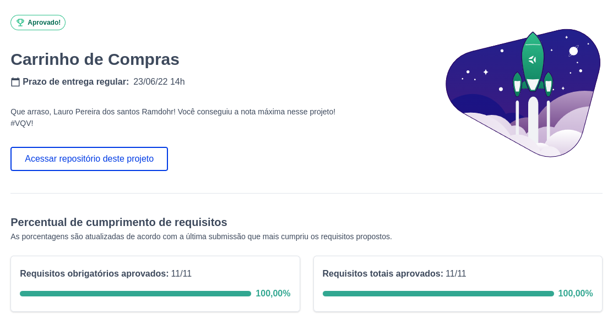

# :shopping_cart: Shopping Cart

## Acesse meu projeto <a href="https://lauropera.github.io/shopping-cart/">AQUI</a>

## :satellite: Desenvolvimento

Nesse projeto desenvolvemos nosso conhecimento em requisições para uma API e funções assíncronas. O desenvolvimento foi em base da metodologia TDD, onde construímos testes unitários antes de desenvolver o código em si.

## :hammer_and_wrench: Tecnologias

* HTML
* CSS
* JavaScript
* Jest

## :heavy_check_mark: Nota:

